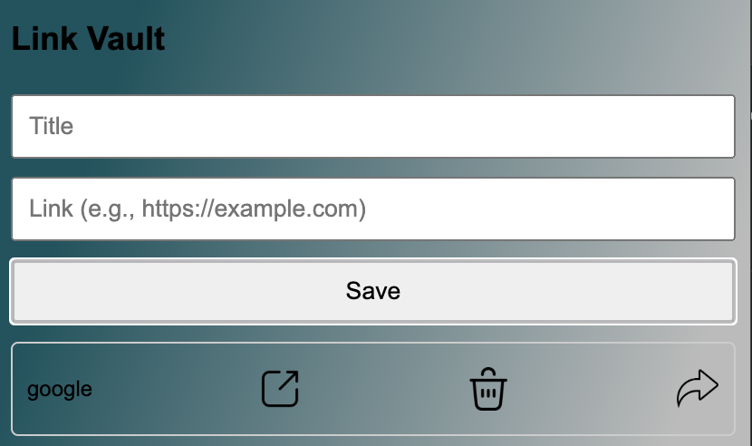

# LinkVault

LinkVault is a handy extension designed to store all your links for future reference.

## Screenshots

### Old Version

### New Version

## Features
- **Store Links**: Save links to visit later.
- **Share Links**: Easily share stored links with others.
- **Open Links**: Open saved links directly from the extension.
- **Delete Links**: Remove links when they are no longer needed.

## Installation

To install LinkVault, follow these steps:
1. Go to the [LinkVault Extension Page](link_to_extension_page).
2. Download and install the extension for your browser.

## Usage

Once installed, use LinkVault as follows:
1. **Saving Links**: Click on the extension icon and add a link.
2. **Managing Links**: Access saved links via the extension's interface.
3. **Sharing Links**: Share links using the provided sharing options.
4. **Deleting Links**: Remove links when you no longer need them.

